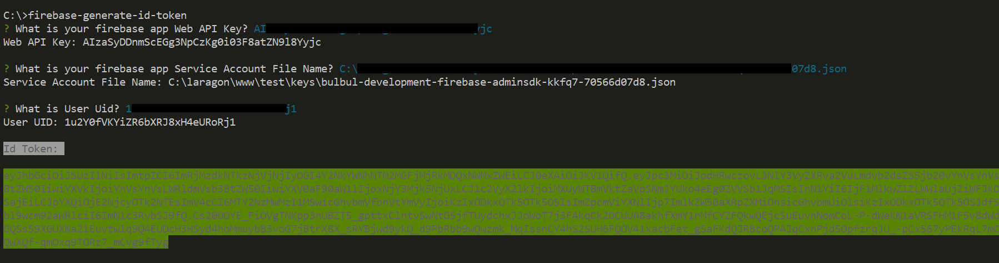

## Introduction

Generate Firebase ID Tokens using CLI without the cumbersome of using the client side to generate tokens.

This package is especially handy for backend developers to generate tokens for testing purposes for their APIs.

----------

## Installation 
This Package can be installed via npm globally

```bash
npm install -g firebase-id-token-generator
```

## How it works



After installing it globally you can use it anytime you need it.

From your terminal run 

```bash
firebase-generate-id-token
```
It will ask you to provide the followings from you firebase project:

`Web API`: you can find it from firebase project settings

 `Service Account File Path`: first enable firebase admin sdk from your project settings then you can download this file

 `User UUID`: you can find it on firebase authentication dashboard 


